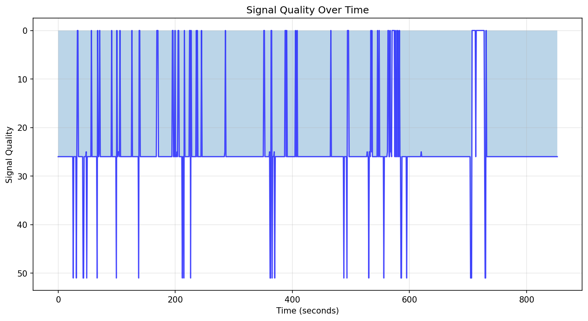
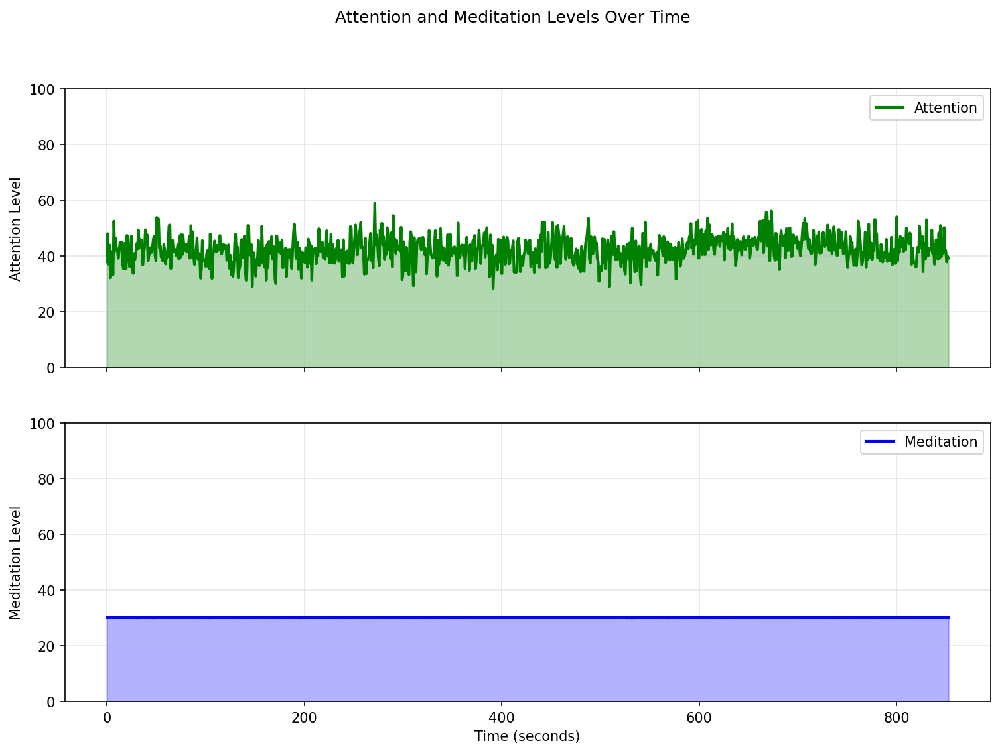
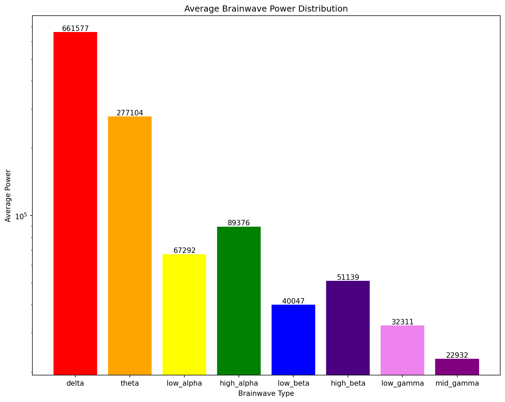
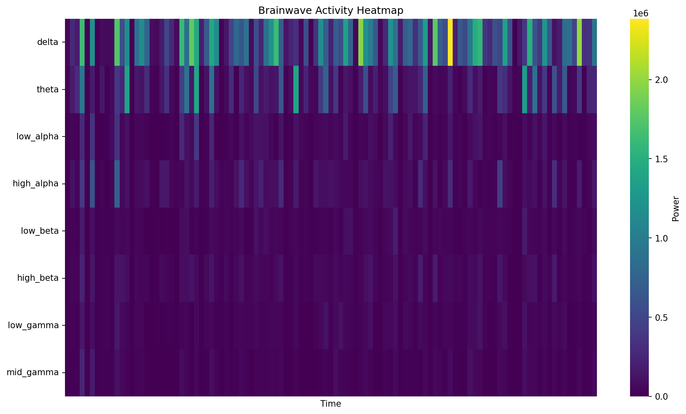
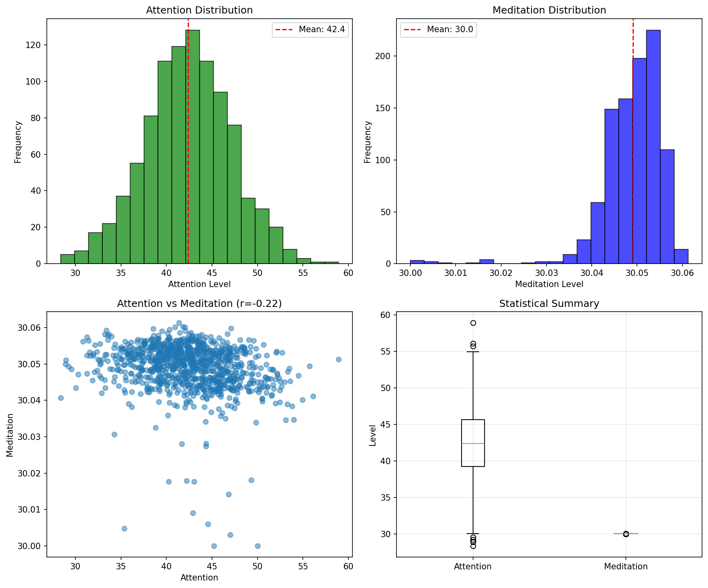

# EEG Analysis Report

**Generated**: 2025-06-09 23:45:12  
**Duration**: 852.5 seconds  
**Total Samples**: 962  
**Run ID**: radiant_telescope

## Signal Quality

Average signal quality: 24.5 (0=best, 200=worst)

## Attention and Meditation

### Attention
- Mean: 42.4
- Std Dev: 4.8
- Min: 28.4
- Max: 58.9

### Meditation
- Mean: 30.0
- Std Dev: 0.0
- Min: 30.0
- Max: 30.1

## Brainwave Analysis

### Average Power Distribution

### Brainwave Activity Over Time

### Brainwave Statistics

| Wave Type | Mean | Std Dev | Min | Max |
|-----------|------|---------|-----|-----|
| Delta | 661577 | 612649 | 2 | 3443720 |
| Theta | 277104 | 345358 | 0 | 2155912 |
| Low_alpha | 67292 | 87809 | 0 | 616984 |
| High_alpha | 89376 | 104288 | 0 | 908772 |
| Low_beta | 40047 | 48811 | 0 | 789103 |
| High_beta | 51139 | 51961 | 0 | 650130 |
| Low_gamma | 32311 | 33532 | 0 | 288433 |
| Mid_gamma | 22932 | 25408 | 0 | 256593 |

## Statistical Analysis

### Key Findings

1. **Signal Quality**: Good average signal quality
2. **Focus State**: Moderate average attention levels
3. **Relaxation State**: Low average meditation levels
4. **Dominant Brainwave**: Delta
5. **Attention-Meditation Correlation**: -0.22

## Session Summary

- Recording started: 2025-06-07T18:37:20.544301
- Recording ended: 2025-06-07T18:55:23.899104
- Valid samples: 962
- Invalid samples: 0
- Average sample rate: 1.1 Hz

---
*Report generated by AddAI EEG Analysis Tool*
