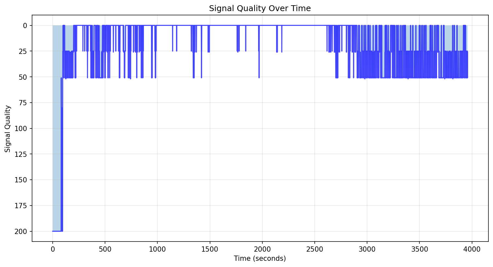
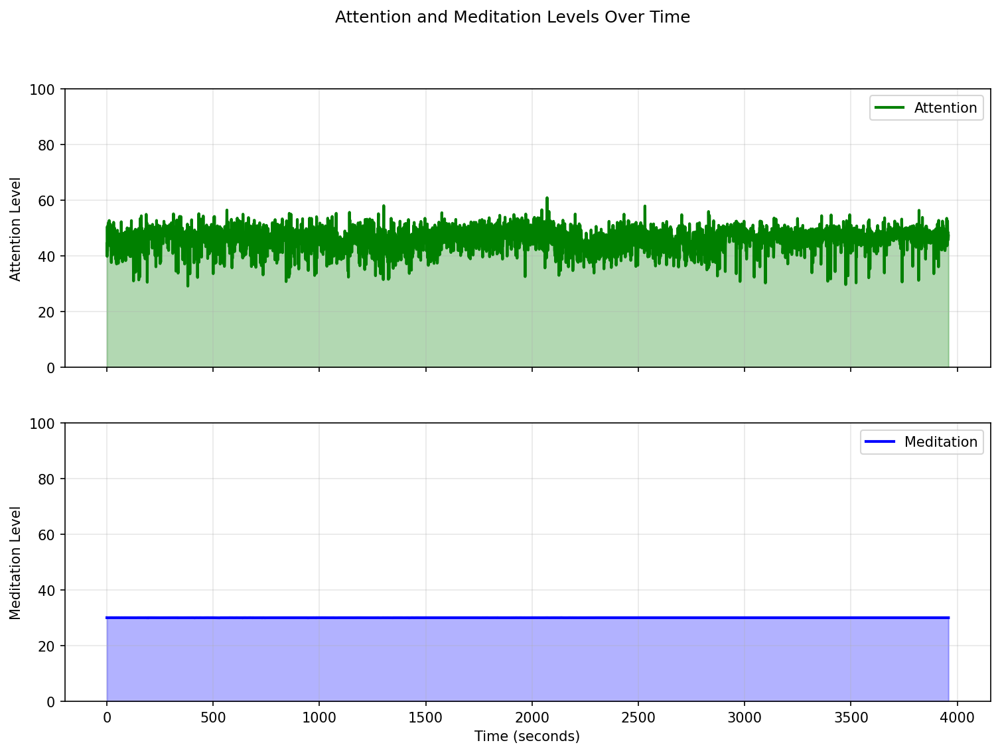
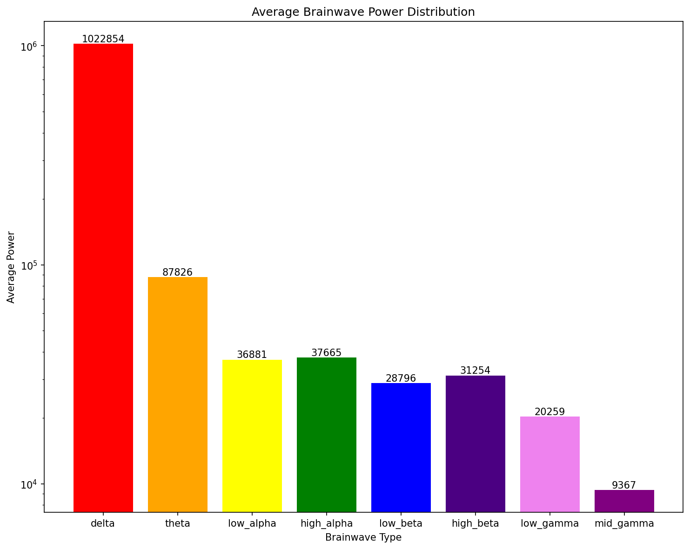
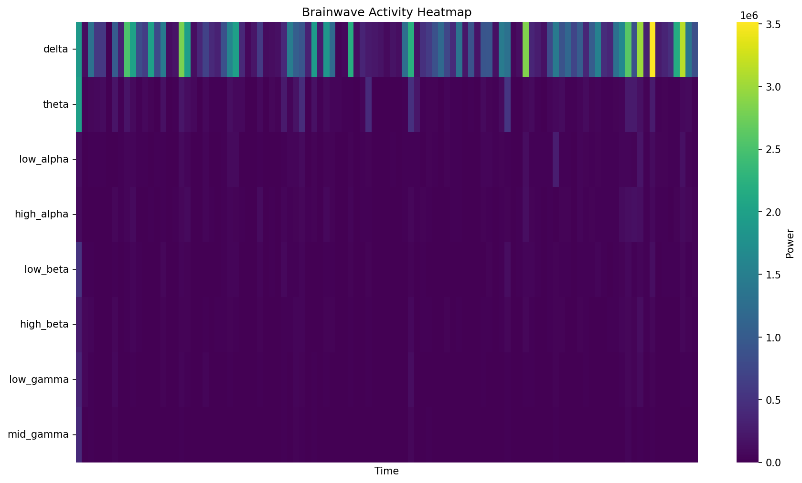
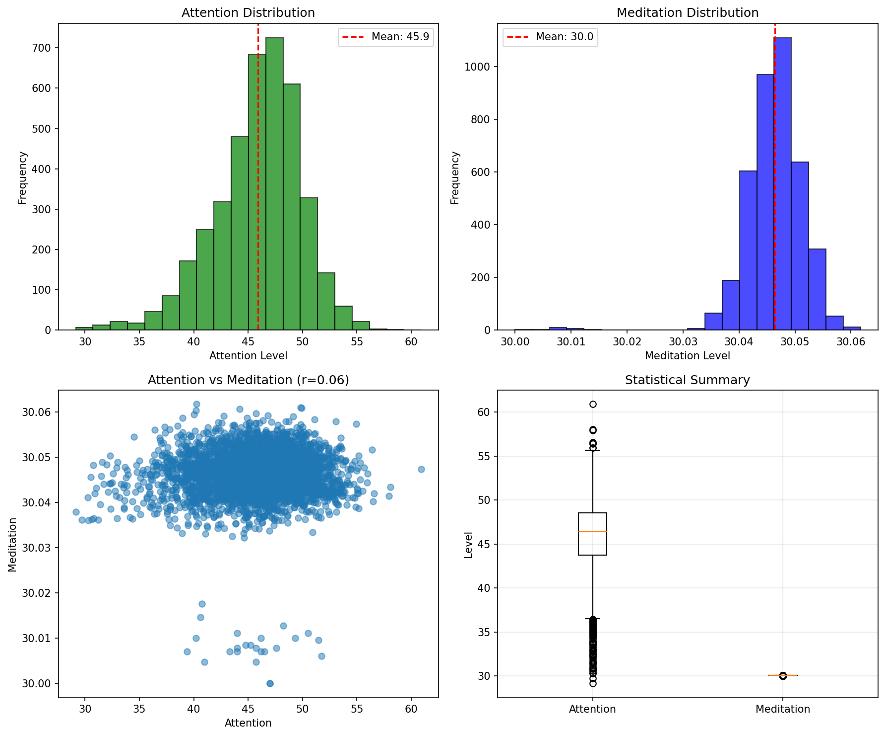

# EEG Analysis Report

**Generated**: 2025-06-09 16:24:02  
**Duration**: 3958.1 seconds  
**Total Samples**: 3983  
**Run ID**: test_unified

## Signal Quality

Average signal quality: 18.2 (0=best, 200=worst)

## Attention and Meditation

### Attention
- Mean: 45.9
- Std Dev: 4.0
- Min: 29.1
- Max: 60.9

### Meditation
- Mean: 30.0
- Std Dev: 0.0
- Min: 30.0
- Max: 30.1

## Brainwave Analysis

### Average Power Distribution

### Brainwave Activity Over Time

### Brainwave Statistics

| Wave Type | Mean | Std Dev | Min | Max |
|-----------|------|---------|-----|-----|
| Delta | 1022854 | 783594 | 0 | 3949273 |
| Theta | 87826 | 147489 | 1 | 2569954 |
| Low_alpha | 36881 | 51960 | 0 | 859342 |
| High_alpha | 37665 | 51751 | 0 | 1066560 |
| Low_beta | 28796 | 44208 | 0 | 1115948 |
| High_beta | 31254 | 56521 | 0 | 1187476 |
| Low_gamma | 20259 | 46895 | 0 | 1178052 |
| Mid_gamma | 9367 | 19363 | 0 | 425328 |

## Statistical Analysis

### Key Findings

1. **Signal Quality**: Good average signal quality
2. **Focus State**: Moderate average attention levels
3. **Relaxation State**: Low average meditation levels
4. **Dominant Brainwave**: Delta
5. **Attention-Meditation Correlation**: 0.06

## Session Summary

- Recording started: 2025-06-07T17:29:52.734849
- Recording ended: 2025-06-07T18:36:38.741652
- Valid samples: 3893
- Invalid samples: 90
- Average sample rate: 1.0 Hz

---
*Report generated by AddAI EEG Analysis Tool*
