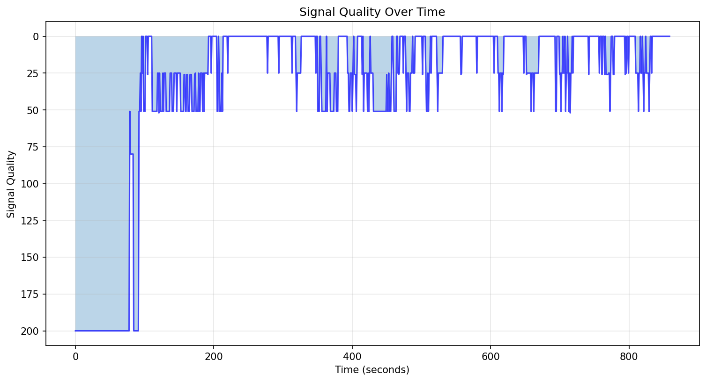
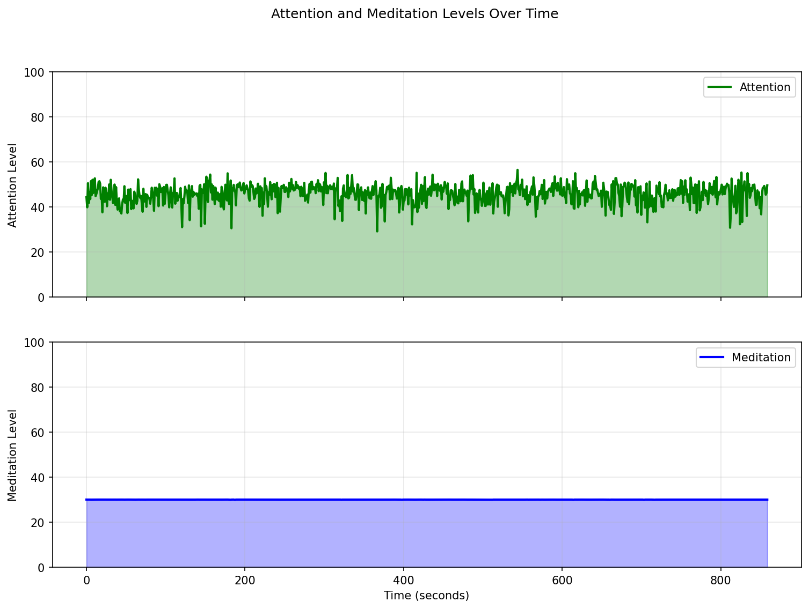
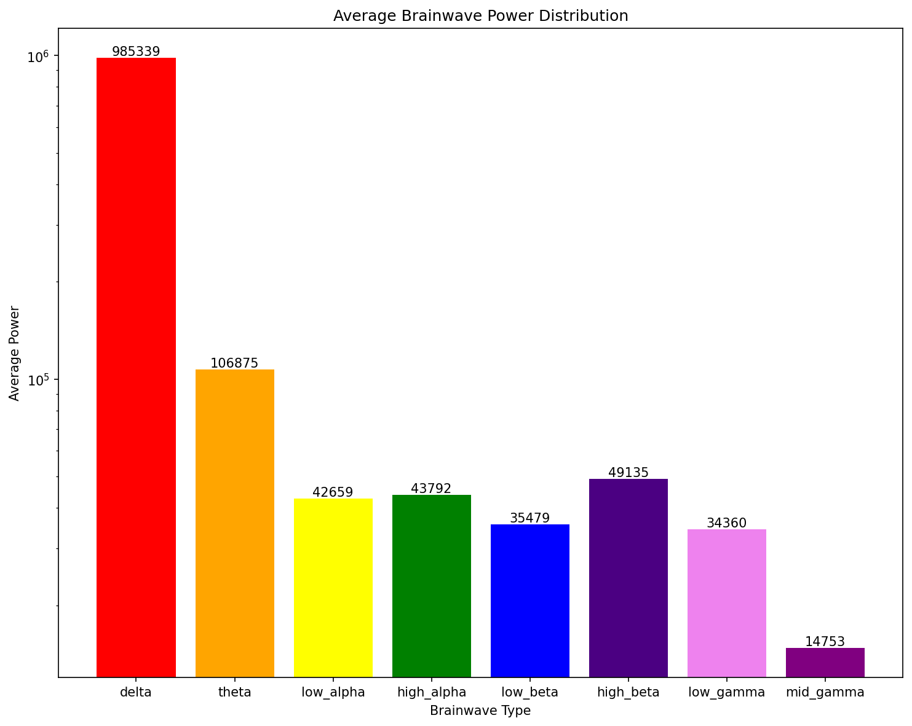
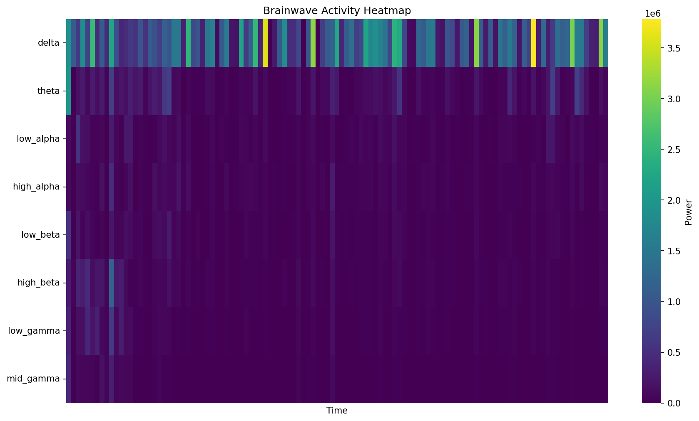
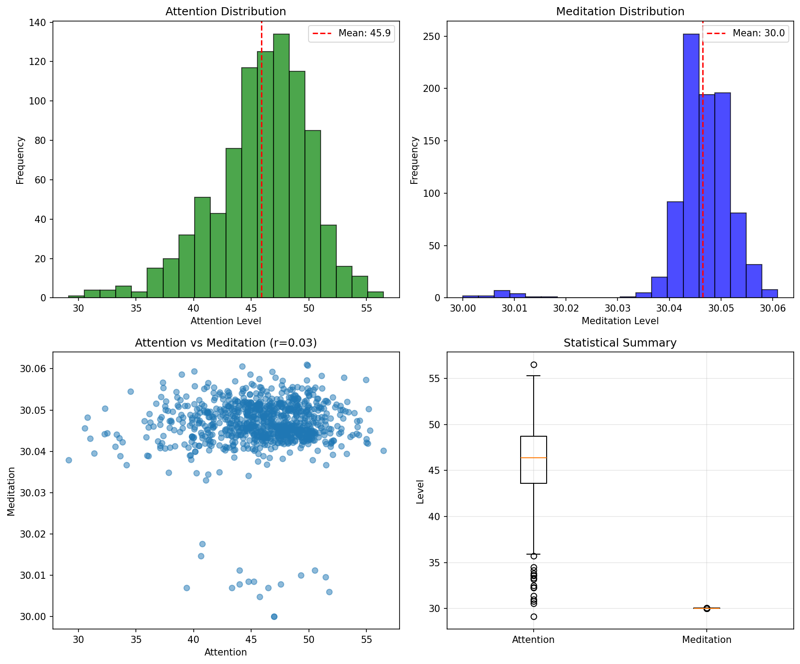

# EEG Analysis Report

**Generated**: 2025-06-09 16:27:29  
**Duration**: 858.7 seconds  
**Total Samples**: 898  
**Run ID**: xaa

## Signal Quality

Average signal quality: 33.7 (0=best, 200=worst)

## Attention and Meditation

### Attention
- Mean: 45.9
- Std Dev: 4.2
- Min: 29.1
- Max: 56.5

### Meditation
- Mean: 30.0
- Std Dev: 0.0
- Min: 30.0
- Max: 30.1

## Brainwave Analysis

### Average Power Distribution

### Brainwave Activity Over Time

### Brainwave Statistics

| Wave Type | Mean | Std Dev | Min | Max |
|-----------|------|---------|-----|-----|
| Delta | 985339 | 757872 | 0 | 3831482 |
| Theta | 106875 | 177783 | 1 | 1967265 |
| Low_alpha | 42659 | 68192 | 0 | 859342 |
| High_alpha | 43792 | 62934 | 0 | 798766 |
| Low_beta | 35479 | 65805 | 0 | 1115948 |
| High_beta | 49135 | 99107 | 0 | 1187476 |
| Low_gamma | 34360 | 82467 | 0 | 1178052 |
| Mid_gamma | 14753 | 31336 | 0 | 425328 |

## Statistical Analysis

### Key Findings

1. **Signal Quality**: Good average signal quality
2. **Focus State**: Moderate average attention levels
3. **Relaxation State**: Low average meditation levels
4. **Dominant Brainwave**: Delta
5. **Attention-Meditation Correlation**: 0.03

## Session Summary

- Recording started: 2025-06-07T17:29:52.734849
- Recording ended: 2025-06-07T17:45:29.708244
- Valid samples: 808
- Invalid samples: 90
- Average sample rate: 1.0 Hz

---
*Report generated by AddAI EEG Analysis Tool*
